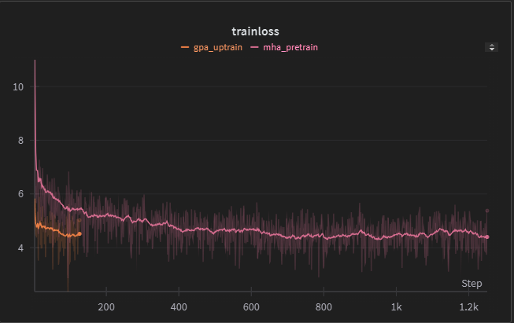

# Implementation of GQA and GQA uptraining
This repository contains an implementation of the constributions described in [***GQA: Training Generalized Multi-Query Transformer Models from
Multi-Head Checkpoints***](https://arxiv.org/pdf/2305.13245v3)

### Background:
Causal multi-headded dot product self-attention is an important mechanism in modern transformer langauge models. Implementing exact attention in a way that efficiently utilizes the hardware can be difficult. Many approximation methods now exist. The earlier [***Multi-Query Attention***](https://arxiv.org/pdf/1911.02150), introduced in 2019, suggested that all the heads in the attention layer would have their own queries, but share the same keys and values. MQA acheived significant speedup at nearly the performance of normal multi-headed attention (MHA).

### Paper Work:
This paper first proposes a generalization of MHA and MQA, called Grouped Query Attention. The authors suggests that we can select a group size, wherein certain groups of heads will share the same keys and queries, but won't share between groups. Having a group size of 1 is equivalent to exact MHA, and with a group size the same as the total number of heads, is equivalent to MQA, with just a single set of keys and queries for all heads.

The second contribution of the paper is to demonstrate that instead of needing to pretrain the full model with GQA layers, we can take a model with normal attention layers and convert it to a GQA model with a small fraction of the compute required to do pretraining. They refer to this process as 'uptraining'. This allows us to speed up inference for existing models without pretraining them using this new attention.

The recently released Llama 3 series of models which are the most capable open source models available, were pretrained with GQA and use it for inference.

### This Repository
This repository contains an implementation of a gpt2-style transformer, along with basic code for pretraining it from scratch. The dataset is [fineweb-edu](https://huggingface.co/datasets/HuggingFaceFW/fineweb-edu) from huggingface.

Due to the fact that the GQA paper's code is not open source and they do not go into optimization details, I opted to go for clarity over speed in the three attention implementations. This means the performance differences between each implementation are basically nonexistant.

In `model.py` there are definitions for the whole model, including implementations of MHA, MQA, and GQA.

Running the `train.py` file will pretrain a gpt2-sm model using normal MHA and save this to disk. It will then convert the pretrained MHA model to GQA by the method recommended in the paper. Finally, it performs the uptraining step to let the model accomodate the changes, and saves this converted model to disk. Pretraining with GQA is easily acheived by changing the model config.

Explanations of the code are contained in comments throughout. Most of the paper-implementation work is contained in the `GroupedQueryAttention` class in `model.py` and `convert_MHA_to_GQA`, the uptraining step, in `train.py`, the rest is pretty boilerplate. Skimming all the attention implementations is recommended to get an idea of the important differences between each.

### Results:
  
(pretraining and uptraining loss curves (in pink and orange respectively) for the model+training configurations in the training file.)

We see that at the start of uptraining, our loss has spiked way up due to the modifications we made to the weights, but falls back down to the pretrained loss with around a tenth of the training steps. These results could be much nicer however, as this model was vastly undertrained and undertuned due to computational and time constraints. Despite this, we still definitely see the converted model has nearly identical performance after the uptraining step despite a reduction in number of overall parameters.

### Running the Code
I did all this on Windows 10 in an anaconda environment using python 3.12.0. This works for me:
```
git clone https://github.com/ekhadley/gqa
```
cd to the installed repo and then
```
pip install -r requirements.txt
```
Pytorch can be installed via pip or conda: `pip3 install torch --index-url https://download.pytorch.org/whl/cu124`